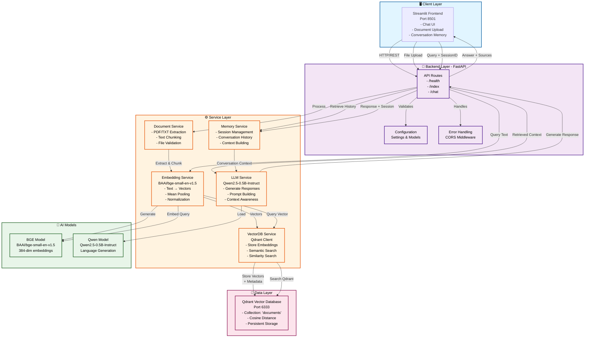

# 🤖 RAG Microservices

> Chat with your documents using AI. Upload a PDF or TXT, ask questions, get accurate answers with source references.


---

## 📖 What Is This?

Upload any **PDF or TXT document**, ask questions in plain English, and get AI-generated answers grounded in your document content — with **conversation memory** so follow-up questions work naturally.

```
📄 Upload: "machine_learning_guide.pdf"

💬 "What is supervised learning?"
🤖 "Supervised learning is a type of ML where the model learns from labeled data..."

💬 "Can you give me an example?"
🤖 "Building on what I said earlier, a classic example is email spam detection..."
     ↑ Remembers the conversation!
```

---

## ✨ Features

- 📄 **Document Indexing** — Upload PDF or TXT files and index them instantly
- 🔍 **Semantic Search** — Finds the most relevant chunks using vector similarity
- 🤖 **AI-Powered Answers** — Qwen-0.5B generates contextual, grounded responses
- 🧠 **Conversation Memory** — Remembers last 5 messages for natural follow-ups
- 📝 **Markdown Responses** — Clean, formatted answers rendered in the UI
- 📚 **Source Attribution** — Every answer shows which document chunks were used

---

## 🛠️ Tech Stack

| Layer | Technology |
|-------|-----------|
| **LLM** | Qwen/Qwen2.5-0.5B-Instruct |
| **Embeddings** | BAAI/bge-small-en-v1.5 |
| **Vector DB** | Qdrant v1.11.3 (self-hosted) |
| **Backend** | FastAPI + Uvicorn |
| **Frontend** | Streamlit |
| **Containers** | Docker + Docker Compose |

---

## 🏗️ Architecture Diagram



---

## 📁 Project Structure

```
rag-microservices/
│
├── backend/
│   ├── app/
│   │   ├── main.py              # App entry point
│   │   ├── api/
│   │   │   └── routes.py        # API endpoints
│   │   ├── core/
│   │   │   └── config.py        # Settings
│   │   ├── models/
│   │   │   └── schemas.py       # Request/response models
│   │   └── services/
│   │       ├── embedding.py     # BGE embedding service
│   │       ├── llm.py           # Qwen LLM service
│   │       ├── vectordb.py      # Qdrant operations
│   │       ├── document.py      # PDF/TXT processing
│   │       └── memory.py        # Conversation memory
│   ├── requirements.txt
│   └── Dockerfile
│
├── frontend/
│   ├── app.py                   # Streamlit UI
│   ├── requirements.txt
│   └── Dockerfile
│
└── infrastructure/
    └── docker-compose.yml       # Service orchestration
```

---

## 🚀 Running Locally

```bash
# Clone the repo
git clone https://github.com/YOUR_USERNAME/rag-microservices.git
cd rag-microservices/infrastructure

# Start all services
docker-compose up -d --build

# Watch startup (first run downloads models — ~10 minutes)
docker-compose logs -f backend
# Wait for: "Startup complete! All services ready."
```

### URLs

| Service | URL |
|---------|-----|
| Chat UI | http://localhost:8501 |
| API Docs | http://localhost:8000/docs |
| Qdrant | http://localhost:6333/dashboard |

---

## 📡 API Reference

### `POST /index`
Index a document into the vector database.

```bash
curl -X POST "http://localhost:8000/index" \
  -F "file=@document.pdf"
```

```json
{
  "status": "success",
  "filename": "document.pdf",
  "chunks_indexed": 24,
  "message": "Successfully indexed 24 chunks"
}
```

---

### `POST /chat`
Ask a question using RAG with optional conversation memory.

```bash
curl -X POST "http://localhost:8000/chat" \
  -H "Content-Type: application/json" \
  -d '{
    "query": "What is machine learning?",
    "top_k": 3,
    "session_id": null
  }'
```

```json
{
  "answer": "## Machine Learning\n\nMachine learning is...",
  "sources": ["document.pdf (chunk 2)", "document.pdf (chunk 5)"],
  "session_id": "abc-123-def-456"
}
```

> Pass the returned `session_id` in your next request to maintain conversation context.

---

### `GET /health`

```bash
curl http://localhost:8000/health
```

```json
{ "status": "healthy", "models_loaded": true }
```

---

### `DELETE /session/{session_id}`
Clear conversation history.

```bash
curl -X DELETE "http://localhost:8000/session/abc-123-def-456"
```

---

### `GET /session/{session_id}`
View conversation history for a session.

```bash
curl "http://localhost:8000/session/abc-123-def-456"
```

---

## 🧠 How It Works

### Indexing

```
Upload file → Extract text → Chunk (500 words, 50 overlap)
    → Generate BGE embeddings → Store in Qdrant
```

### Chat (RAG)

```
User question → Generate query embedding
    → Similarity search in Qdrant (top K chunks)
    → Fetch last 5 messages from session memory
    → Qwen LLM generates answer from context + history
    → Return markdown answer with sources
```

---

## ⚙️ Configuration

Edit `backend/app/core/config.py` to tweak behaviour:

```python
EMBEDDING_MODEL  = "BAAI/bge-small-en-v1.5"
LLM_MODEL        = "Qwen/Qwen2.5-0.5B-Instruct"

CHUNK_SIZE       = 500    # Words per chunk
CHUNK_OVERLAP    = 50     # Overlap between chunks
MAX_NEW_TOKENS   = 256    # Max response length
TEMPERATURE      = 0.7    # 0 = precise, 1 = creative
```

Edit `backend/app/services/memory.py` for memory settings:

```python
max_history_per_session = 10   # Messages to remember
session_timeout_hours   = 24   # Session expiry
```

---

## 🐛 Common Issues

| Problem | Fix |
|---------|-----|
| Backend not starting | Models still downloading — wait 10-15 min and watch logs |
| Out of memory | Needs 6-8 GB RAM minimum |
| Qdrant collection conflict | Run `docker-compose down -v` then restart |
| Slow responses | Expected on CPU — Qwen-0.5B takes ~5s per response |

```bash
# Useful debug commands
docker-compose ps                    # Check all containers
docker-compose logs -f backend       # Watch backend logs
docker stats                         # Check memory usage
```

---

## 📝 License

MIT